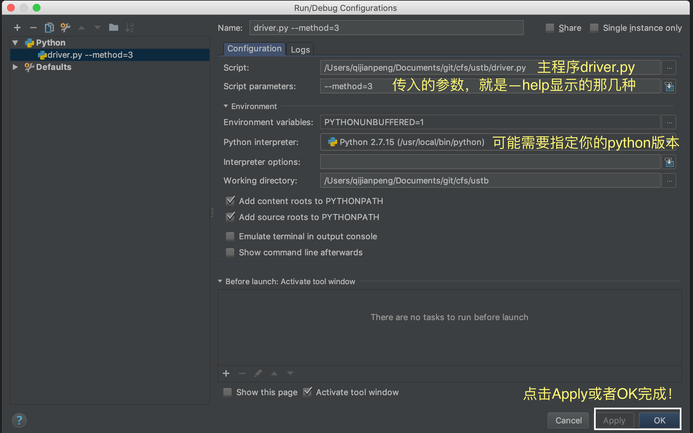

# Recommendation-System
Recommendation System

# Includes
1. [Collaborative-Filtering-System](ustb/cf/README.md)
2. [Books recommendation based Doc2Vec](ustb/cb/README.md)

# Usages
Try: `python driver.py --help` on your command line to see what happens!

# Requirements:
- Python 2.7
- Pandas # 数据的ETL
- scipy # 一些相似度使用的公式，如cosine，Pearson等
- argparse # 传入参数解析
- [Gensim 3.6.0](http://radimrehurek.com/gensim): Python framework for
fast Vector Space Modelling;
- [Numpy 1.13](http://www.numpy.org) (notes: gensim 3.6.0 not compatible for numpy version 1.14 and
  above, may be you need downgrade your numpy version for temporary.)
- [jieba 0.39](https://github.com/fxsjy/jieba): Chinese Words
Segementation Utilities.


# Developments
0. **Clone Projects to your local.**
```bash
git clone git@github.com:qijianpeng/Collaborative-Filtering-System.git cfs
```

1. **For PyCharm**

 - 本项目包含目录`.idea`, 已对`sources`及`library`进行添加，可直接打开PyCharm选择导入项目.（Thanks 尚秀同学发现问题～）
 - Debug 环境：已经默认添加了`python --method=3` nmf方法，其他可以类似仿照, 步骤如下：
  1. 选择Edit Configurations:
    
  2. 点击弹出窗口左上角+号，Add New Configurations, 按照如下方式配置：
    

2. **For Others**

 VIM直接进行编辑即可.


# TODO LISTS
CF:
- :hushed: Evaluator: We need evaluation method(s) to test the result.
    1. Regularizate results of differents CF methods.
    2. Evaluate all the results but not a single user for CF methods.
- :wink: 《Recommender Systems Handbook》 lists many interesting methods, 
  Item-based, User-based are all in Chaptor 4: A Comprehensive Survey of Neighborhodd-based
  Recommendation Methods. 2 categories are not enough to understand RS. Here is
  a short todo lists:
  1. Content-based methods
  2. Chaptor 5: Advances in Collaborative Filtering.
- :running: normalization of ratings
- :running: Page 130, Threshold filtering, should use a pipeline filter way.(Pipeline filtering)


# Feedback
Just open an issue, we'll reply A.S.A.P.

:beers:

